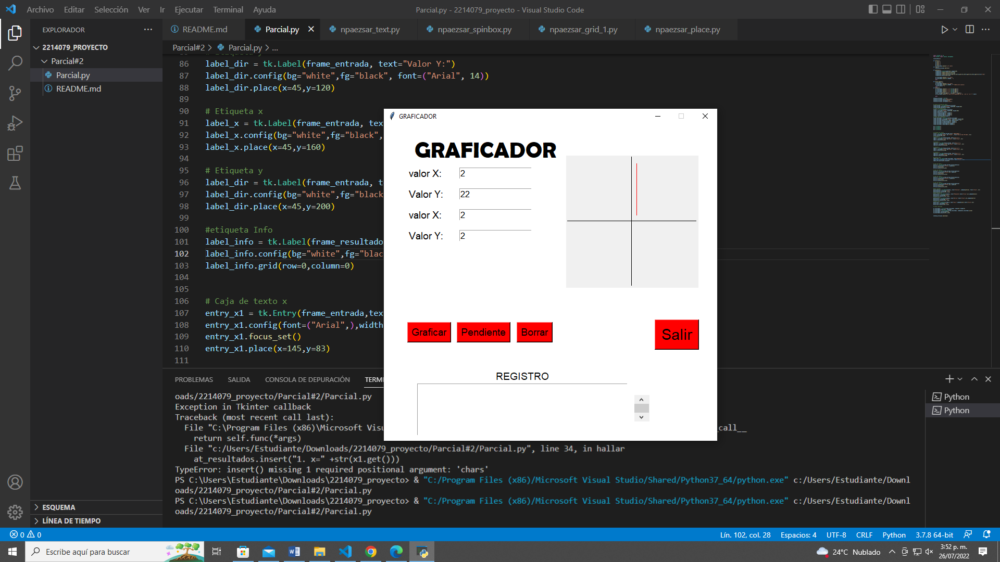

# Parcial #2 
Diseñar e implemantar una app con python, usando la librería tkinter, que permita rersolver el siguente problema:

un profesor de matematicas requiere una herramienta que permita graficar una linea recta en el plano carteciano, dados  dos puntos (x,y)pertenecientes a dicha recta. igualmente, que calcule su pendiente. La app inicia mostrando el plano carteciano con sus respectivos ejes y origen, asi como cuatro campos de texto para ingresar los valores de x e y, de las dos puntos de la recta. Debe existir un widget por medio de la cual se genere un evento para grafiacar la linea, asi como para calcular y mostar el valor de la rescpectiva pendiente. 

